# Проект 3. Участие в соревнование на Kaggle

## Оглавление

[1.Цель проекта](#1-Цель-проекта)

[2. Краткая информация о данных](#2-краткая-информация-о-данных)

[3. Основные этапы проекта](#3-основные-этапы-проекта)

[4. Результаты](#4-результаты)

[5. Выводы](#5-выводы)

### 1 Цель проекта

Вы работаете датасаентистом в компании Booking. Одна из проблем компании — это нечестные отели, которые накручивают себе рейтинг. Одним из способов нахождения таких отелей является построение модели, которая предсказывает рейтинг отеля. Если предсказания модели сильно отличаются от фактического результата, то, возможно, отель играет нечестно, и его стоит проверить.

Вам поставлена задача создать такую модель. 
Точность на тестовой выборке должна быть меньше MAPE - 13.5%

[Ссылка на страницу соревнования](https://www.kaggle.com/competitions/sf-booking)

:arrow_up:[к оглавлению](#оглавление)

### 2 Краткая информация о данных

При работе над проектом были использонаны следующие данные:

1. hotels_test.csv - набор данных для тестирования модели

2. hotels_train.csv - набор данных для тренировки модели

3. submission.csv - предсказанные значения целевого признака на тестовом наборе данных

4. Набор рисунков с графиками в папке pic

5. Непосредственно сам файл с кодом обработки данных HW_Project_3_model.ipynb 

6. Используемые версии библиотек приведены в файле requirements.txt

:arrow_up:[к оглавлению](#оглавление)

### 3 Основные этапы проекта

Проект состоит из девяти частей:

* Загрузка данных

* Заполнение пропусков

* Преобразование данных и создание новых признаков

* Работа с отзывами

* Кодирование признаков

* Нормирование численных признаков

* Анализ признаков

* Обучение модели

* Применение модели к тестовой выборке

:arrow_up:[к оглавлению](#оглавление)

### 4 Результаты

1. Тестовая и тренировочная выборка были загружены и объединены для совместной обработки

2. Пропуски координат отелей были заполнениы координатами города отеля. Как показала практика замена на нули, как было изначально, на модели слабо сказывается. При заполнении пропусков были созданы вспомогательные признаки - 'city, country', 'city', 'country'.

3. Преобразование данных и создание новых признаков заключалось в следующем:

   * Признак 'days_since_review' приведем к целочисленному значению.
   * Признак 'review_date' приведен к типу даты и на его основе сформированы новые признаки - квартал, месяц и год.
   * Создан признак гражданства посетителя отеля - 'citizen'.
   * Проведен промежуточный анализ созданных признаков - были полученны следующие графики:
   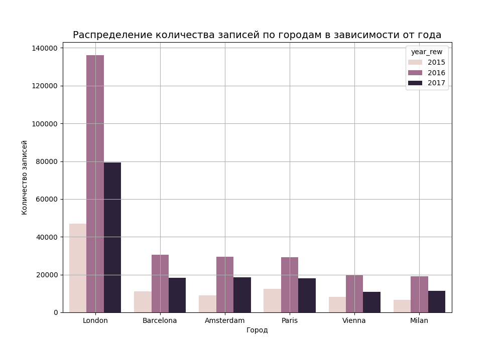
   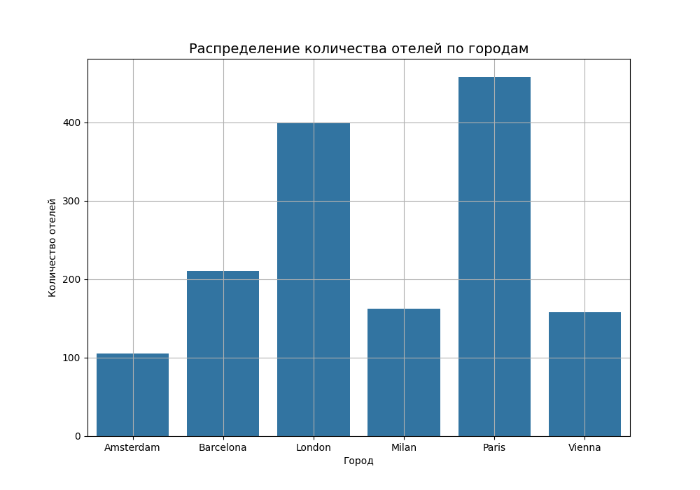
   На основании графиков были сделаны следующие выводы:   
      1. Наибольшее количество записей приходится на 2016 год.
      2. Наибольшее количество записей приходится на отели Лондона.
      3. Наибольшее количество рассматриваемых отелей находятся в Париже.
   * Проведен анализ распределения оценок для выорки отелей - распределение отлично от нормального.
   * Из распределений медианной оценки для выборки отелей видно, что имеются пропуски как по месяцам, так и по годам для отелей.
   * Рассмотрено распределение колиства записей для всех отелей от месяца и квартала в зависимости от гражданства посетителя:
   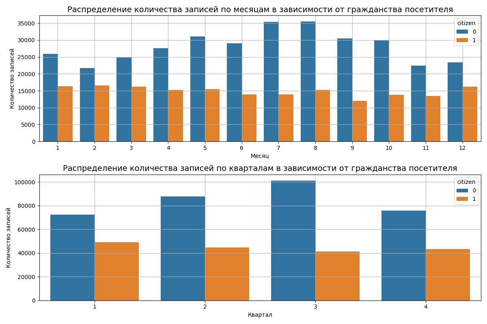
   
   Из распределений видно, что максимум приходится на летние месяцы (3 квартал). При этом наблюдается приток посетителей из других стран и незначительный отток местных жителей.
   * На основе тегов созданы признаки 'Leisure_trip', 'Business_trip' и 'Count_tags'.
   * Проведен анализ полученных признаков:
   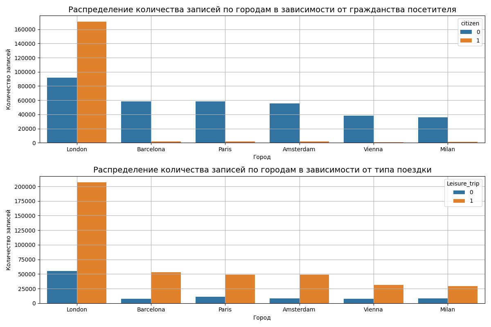
   
      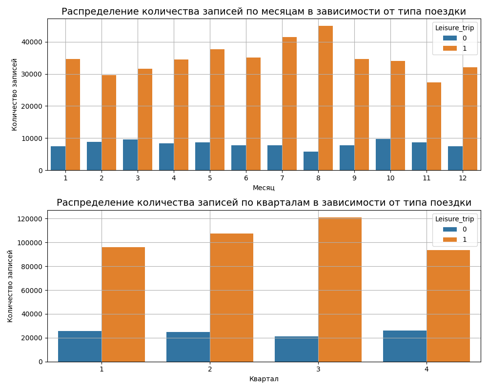
   
   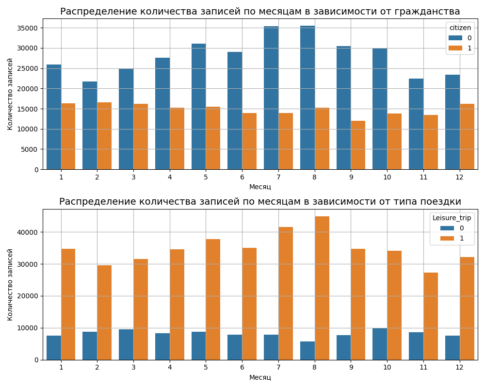
   
   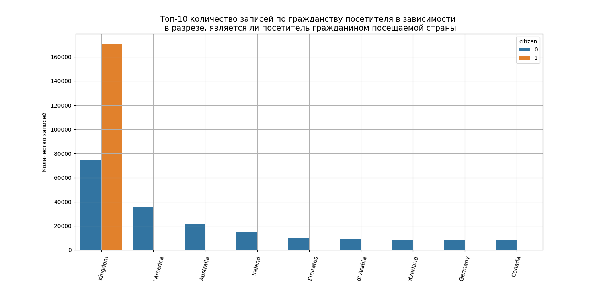   
   * Для дополнительного анализа создан вспомогательный признак - тип поездки. На основании данного признака показано распределение записей по типу поездки

   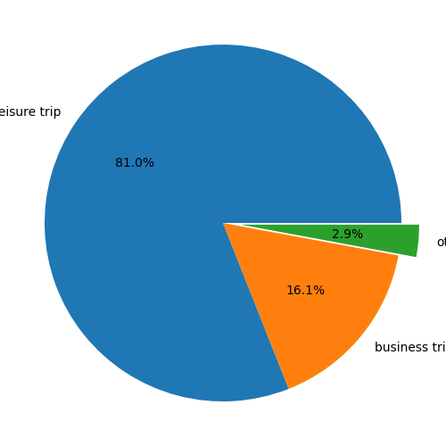
   
   Основные выводы из анализа:
   * Представленные данные неоднородны: наибольшее количество посетителей - подданные UK; наибольшее количество отелей находится в Париже, а наибольшее количество записей приходится на отели Лондона
   * Большинство посетителей отелей Лондона - подданные UK, для остальных стран - имеется обратная тенденция - большинство посетителей - иностранцы
   * Распределения в зависимости от месяца более информативны, чем в зависимости от квартала - признак квартала можно убрать
   * Разбор тегов вносит ряд особенностей. Например, 2.9 % записей либо имеют тип поездки отличный от туристической или деловой, либо это пропуски. Т.е. разбирая теги, помимо информации мы вносим и пропуски.

4. При работе с отзывами были созданы новые признаки - 'No_Negative' и 'No_Positive'. Помимо этого проведен анализ отзывов посетителей с помощью SentimentIntensityAnalyzer. По результатам анализа сформированы еще 8 признаков - 'neg_rew_from_neg', 'neg_rew_from_pos', 'pos_rew_from_neg', 'pos_rew_from_pos', 'neu_rew_from_neg', 'neu_rew_from_pos', 'compound_from_neg' и 'compound_from_pos'

5. При кодировке был закодирован признак национальности посетителя методом BinaryEncoder

6. Была проведено нормирование числовых признаков

7. Проведен анализ признаков
   * Проведен анализ корреляции признаков по Пирсану и Спирмену: 
   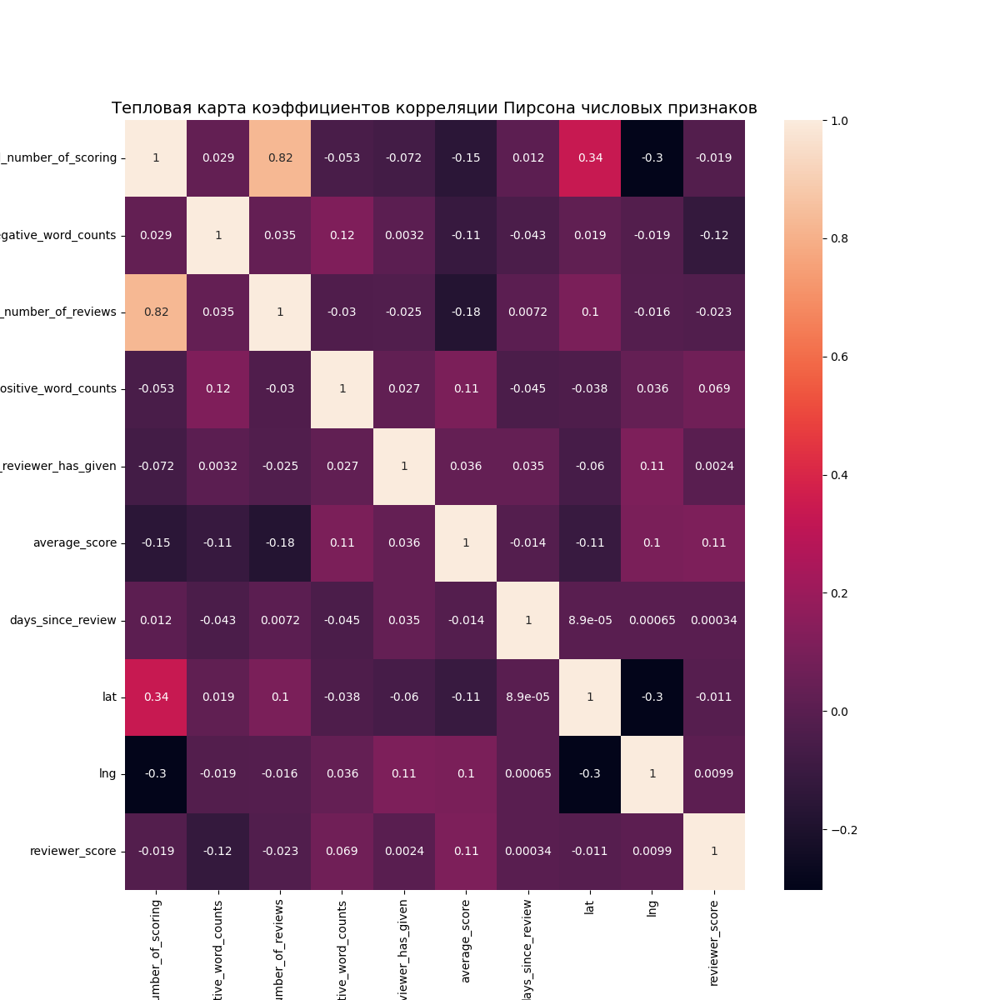
   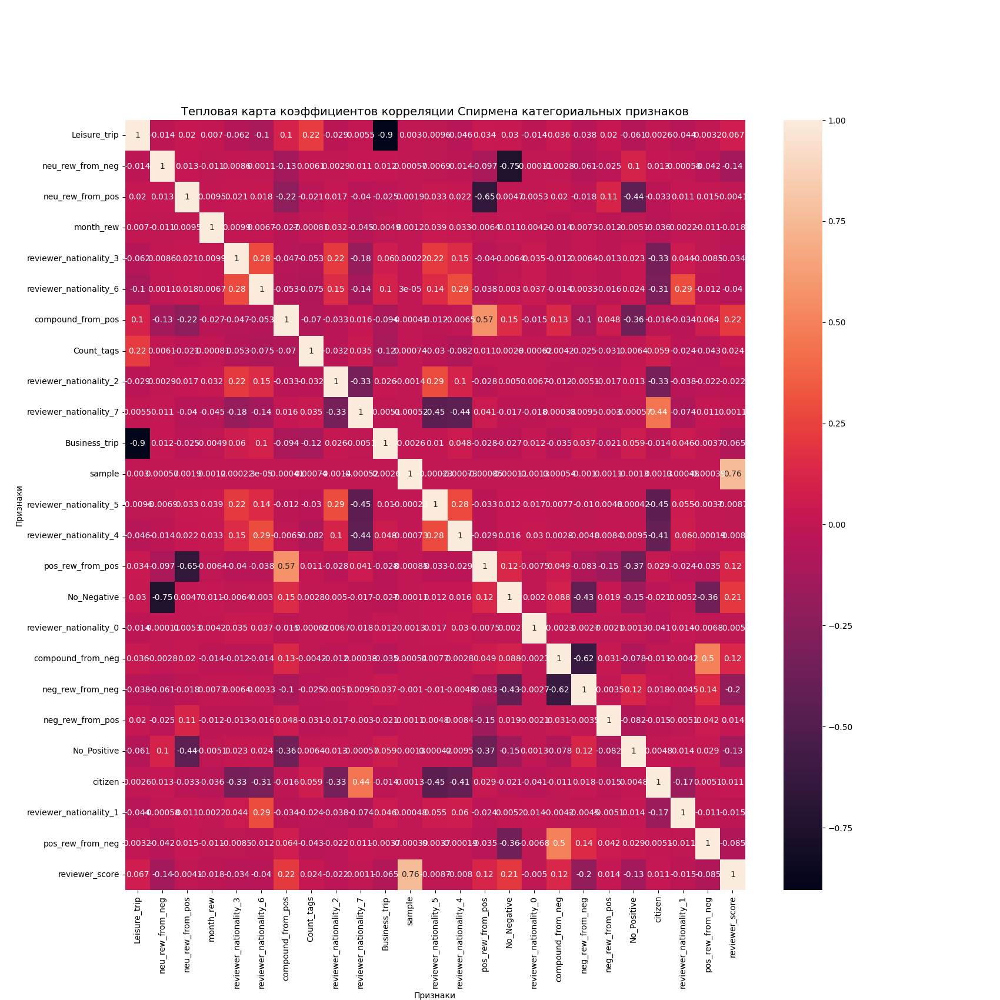
      * Из численных признаков только признаки 'total_number_of_reviews' и 'additional_number_of_scoring' имеют сильную связь
      * Из категориальных признаков самая сильная корреляция наблюдается между признаками 'Leisure_trip' и 'Business_trip' - как показала практика оставим оба
      * Также сильная корреляция наблюдается между 'neu_rew_from_neg' и 'No_Negative' - тоже оставляем
8. Обучение модели состояло в следующем:
   * Проведен анализ значимости признаков методом Хи-квадрат и f_classif:
   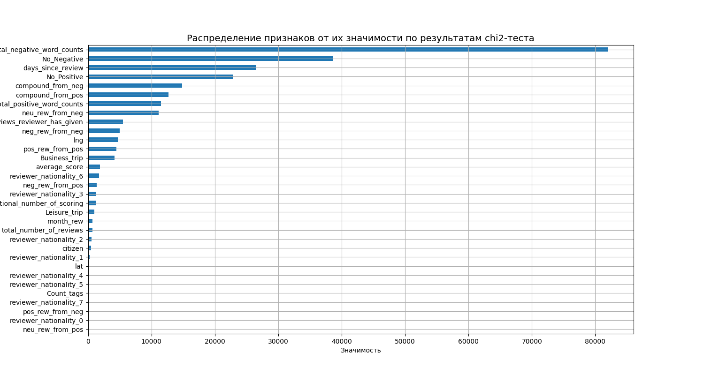
   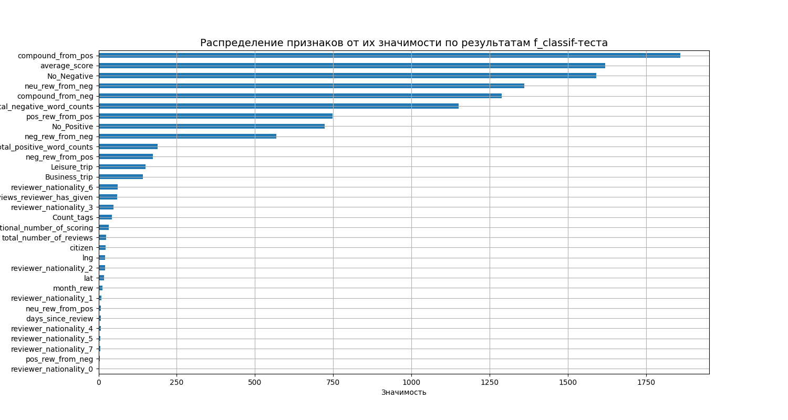
      * Согласно Хи-квадрат наиболее важные признаки - 'review_total_negative_word_counts', 'No_Negative' и 'days_since_review'
      * Согласно f_classif - 'compound_from_pos', No_Negative' и 'average_score'
   * Было проведено обучение модели на тренировочной выборке - средняя абсолютная процентная ошибка предсказанных значений от фактических (MAPE) составила 12.52%
   * Показано влияние признаков по 'мнению' модели:
   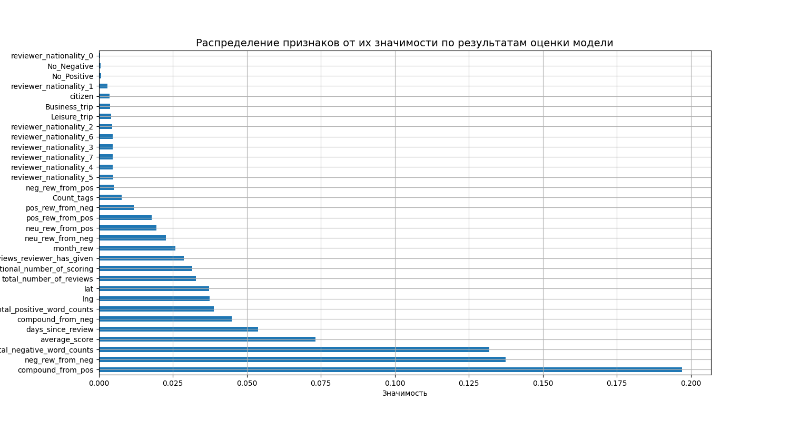
   Согласно модели наиболее важные признаки - признаки полученные при анализе отзывов посетителя. Наиболее близкие по значимости данные давал тест f_classif

   * По результатам обучения модели были получены предсказания для тестовой выборки и записаны в файл submission.csv, который был использован для участи в соревновании.

:arrow_up:[к оглавлению](#оглавление)

### 5 Выводы
* Нам были переданы данные с оценкой отеля посетителя и по ним обучена модель предсказывающая по данным посетителя его еценку - что не соответствует Т.З. - необходимо предсказать рейтинг отеля. Рейтинг конечно тоже зависит от оценки посетителя, но уж точно не одного. Полученную модель можно использовать, например, для востановления оценки посетителя.
* Переданные данные очень неоднородны (наибольшее количество отзывов относится к посетителям из UK и к отелям Лондона) при этом все записи описывают только отели в 6 городах в 6 разных странах.
* Наибольшее влияние на качество модели оказывает анализ отзывов посетителей.
* Работа с тегами вместе с новыми признаками добавляет и пропуски в этих признаках.
* Предположительно, улучшить качество модели можно, проведя более детальный анализ отзывов и тегов

:arrow_up:[к оглавлению](#оглавление)